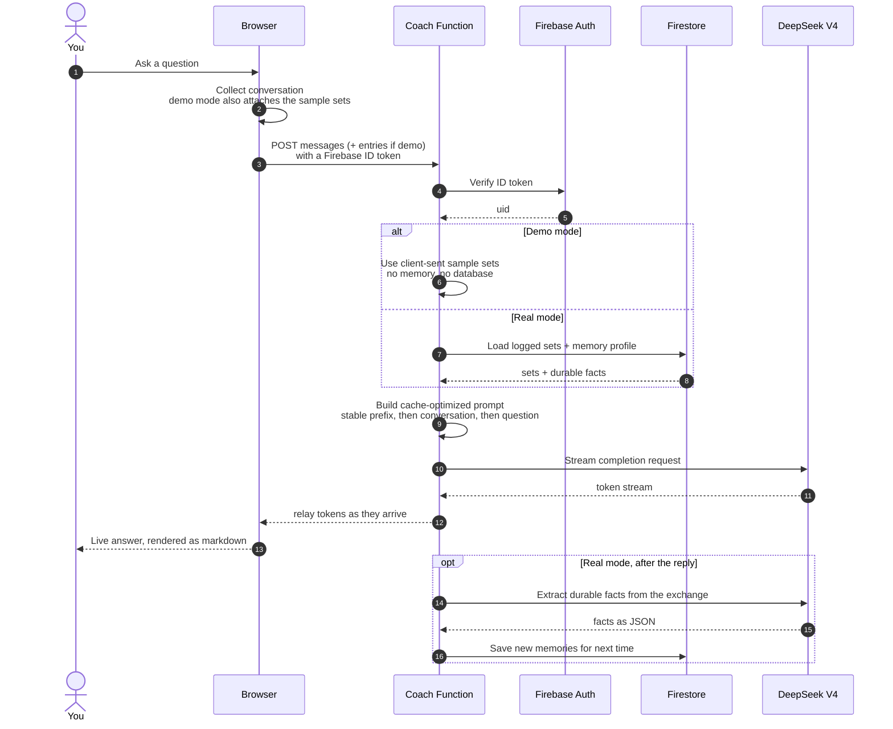
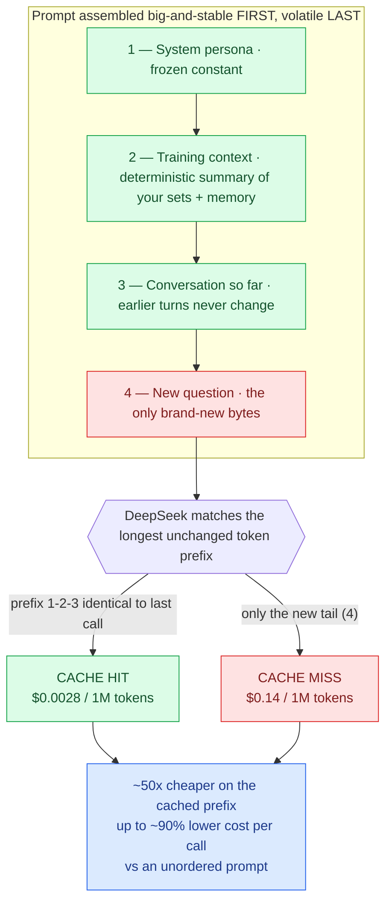

# Architecture

Two diagrams that cover the interesting engineering: how the **AI coach** answers a
question end-to-end, and the **cache-optimized prompting** that makes those calls cost
almost nothing.

---

## 1. AI Coach — request lifecycle

The browser never talks to DeepSeek directly. Every message goes through a Firebase
Cloud Function that verifies who you are, loads your data, builds the prompt, streams the
answer back, and quietly learns durable facts about you for next time. In demo mode the
sample sets ride along with the request and nothing is read from or written to your real
data.



**Why it's built this way**

- **The key stays server-side.** The DeepSeek API key lives in Firebase Secret Manager and
  never reaches the browser; the function is the only thing that holds it.
- **Memory is separate from chat.** Durable facts (sleep, nutrition, training days, injuries,
  goals) are stored apart from any conversation and re-injected into *every* new chat, so the
  coach feels like it remembers you across sessions.
- **Demo is fully isolated.** Sample-mode requests carry their own data and skip the memory
  step entirely — they can never read or pollute your real profile.

---

## 2. Cache-optimized prompting — the "secret weapon"

DeepSeek caches by matching the **longest unchanged token prefix** of a request, and serves
those cached tokens at roughly **1/50th** the price of fresh ones. The trick is simply to put
the big, stable content **first** and the volatile content **last** — so the cache prefix
covers almost the entire prompt on every call.



**The cost math**

A coach call is mostly stable prefix (persona + training summary + earlier turns) with a tiny
new question at the end. If ~95% of the input matches the cached prefix:

```
unordered prompt:   1.00 × $0.14            = $0.140 / 1M
cache-optimized:    0.95 × $0.0028
                  + 0.05 × $0.14            ≈ $0.010 / 1M
                                            ≈ 93% cheaper
```

Put the volatile bytes first instead, and the prefix changes on every call — nothing caches,
and you pay full price every time. Ordering is the whole game.

> Prices: DeepSeek V4 `deepseek-chat`, fresh input **$0.14 / 1M** vs cached input
> **$0.0028 / 1M**. For comparison, most providers discount cached tokens ~10×; DeepSeek
> does ~50×.
