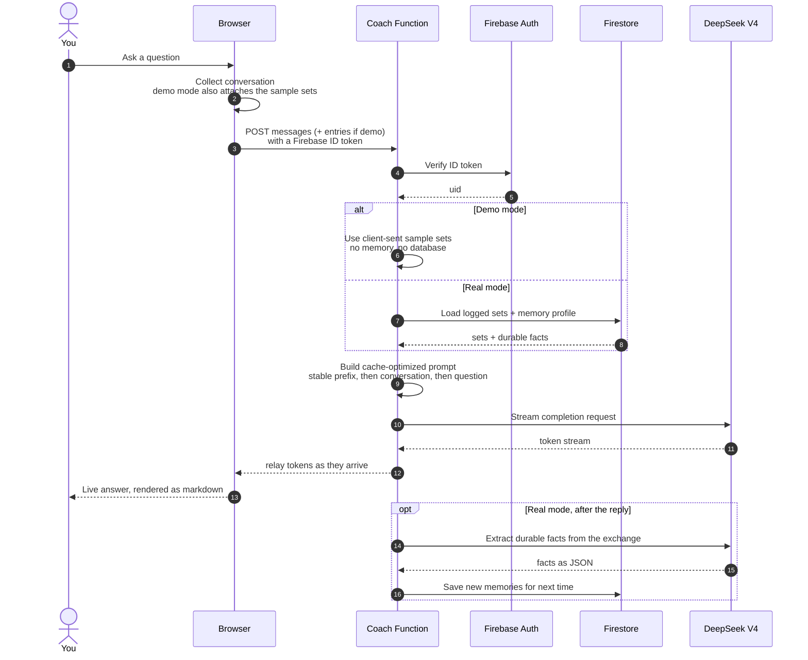
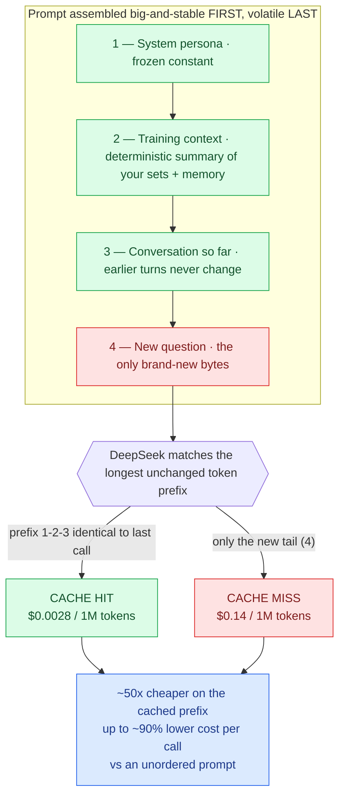

# gym2track

A fast, mobile-first workout tracker with an AI coach that actually knows your training.

**Live:** [gym2track.netlify.app](https://gym2track.netlify.app)

Log your sets, watch your strength trend on a real metric (not vanity volume), and chat with a coach that has your full history and a persistent memory of you — sleep, nutrition, injuries, goals — across every conversation.

---

## Features

- **Log** — pick a day (Push / Legs / Pull), an exercise, then weight × reps. The date is captured automatically; backdating is a tap away.
- **History** — a date × exercise grid plus a per-exercise "Focus" view.
- **Progress** — strength charts built on **estimated 1-rep-max** (Epley: `weight × (1 + reps/30)`), so a heavy single and a lighter set of ten are directly comparable. No naive volume.
- **AI Coach** — a chat that's grounded in your logged sets *and* a long-term memory profile, with multi-conversation history and markdown replies.
- **PWA** — installable, offline-capable, no app store.
- **Light / dark** editorial theme, and an isolated demo-data mode for exploring without touching real data.

## Architecture

Two diagrams cover the interesting engineering. (Deeper notes and the cost math live in **[ARCHITECTURE.md](ARCHITECTURE.md)**.)

### AI Coach — request lifecycle

The browser never talks to DeepSeek directly. Every message goes through a Firebase Cloud Function that verifies you, loads your data, builds the prompt, streams the answer back, and quietly learns durable facts about you for next time. In demo mode the sample sets ride along with the request — nothing touches your real data.



### Cache-optimized prompting — the "secret weapon"

DeepSeek serves cached tokens at ~1/50th the price of fresh ones, matching on the **longest unchanged token prefix**. So the prompt is assembled big-and-stable first and volatile last — the cache covers almost the whole thing on every call, and only the new question is paid at full price.



## Tech stack

- **Frontend:** vanilla HTML/CSS/JS, ES modules, **no build step** — deploys as a static folder.
- **Auth + data:** Firebase Authentication (Google + email/password) and Cloud Firestore, with security rules scoping every user to their own subtree.
- **AI Coach backend:** a Firebase Cloud Function (Node 22, streaming HTTPS) proxying **DeepSeek V4**. The API key never reaches the browser — it lives in Firebase Secret Manager.

## How it works (the interesting bits)

- **A real progress metric.** All trends use Epley e1RM, isolated in one function (`js/state.js → epley()`), so reps and weight are weighed together.
- **The coach has memory.** Durable facts about you (extracted from past chats) are stored separately from conversations and injected into *every* new chat, alongside a deterministic summary of your training.
- **Cache-optimized prompting.** The function orders the prompt as `frozen persona + your training context (stable prefix) → conversation → new question`. Because the long prefix never changes between calls, DeepSeek serves almost all of it from its prefix cache — where cached tokens cost ~50× less than fresh ones. In practice that's up to a ~90% cut in inference cost versus an unstructured prompt.
- **Demo / real isolation.** Sample data lives in its own store and is *never* written over your real data. In demo mode the coach answers on the sample sets and writes no memories; switching demo off resets the demo session cleanly.

## Project structure

```
index.html            # shell: 4 swipeable panels + bottom dock
styles.css            # editorial light/dark design tokens
sw.js                 # service worker (offline cache)
js/
  app.js              # boot, pager/dock sync, auth + cloud wiring
  state.js            # store, selectors, e1RM, demo/real isolation
  log.js history.js progress.js coach.js settings.js
  cloud.js            # Firebase Auth + Firestore
  exercises.js icons.js
functions/
  index.js            # AI Coach Cloud Function (DeepSeek proxy)
firestore.rules       # per-user access rules
firebase.json .firebaserc
```

## Running locally

It's a static site — serve the folder with anything:

```bash
python3 -m http.server 8788
# open http://localhost:8788
```

Auth and the coach need a Firebase project (the included config points at one). To use your own, swap the config in `js/cloud.js` and deploy the function.

## Deploying

- **Frontend:** drop the folder on Netlify (or any static host).
- **Coach function:**
  ```bash
  cd functions && npm install
  firebase functions:secrets:set DEEPSEEK_API_KEY   # paste your key
  firebase deploy --only functions
  ```

---

Designed and largely built with **Claude** — including the e1RM choice and the cache-optimized prompt architecture.
